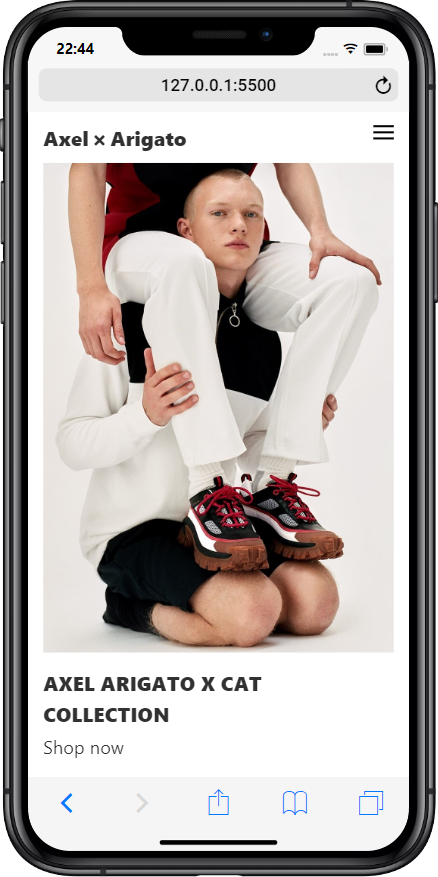

# Microverse-Capstone-Sneakers-Shops

<!-- PROJECT LOGO DESKTOP-->
 

  

  <h3 align="center">Axel x Arigato Sneakers Shop Project for Microverse</h3>

 

  <a href="https://raw.githack.com/leonmezu1/Second-Capstone-for-Microverse/Beta-Branch/index.html">Project-Preview</a>

<!-- ABOUT THE PROJECT -->
# About The Project

Axel Arigato is a contemporary fashion brand injected with counter-cultural references. From the beginning. Axel Arigato has always been about showcasing the imagery the brand was started with and channeling it through a visual language. These references illustrate the kind of world Axel Arigato wants to project. 

This capstone project intends to recreate the web version of the store taking care of the using experience and UI design.

You can have a look to the design template in the next link.

[-BeHance](https://www.behance.net/gallery/80392909/AXEL-ARIGATO-Website)

## Project objectives

* Build the most of the posibles app interfaces translated to the web
* Use semantic HTML tags
* Use CSS selectors correctly
* Use HTML elements box model (margin, padding, width, height).
* Use industry-standard tools (flexbox) to place elements in the page.
* Check the ability to create UIs adaptable to different screen sizes using mediaqueries.
* Apply front-end best practices.

## Skills to use and requirements:

*Ability to create UIs adjusted to given designs.

## Constraints

MUST: use of linterns, Bootstrap CSS classes, follow CSS best practices, use of CSS Reset, use W3c validation services.

### Built With

* [Bootstrap](https://getbootstrap.com)

* [Jquery](https://code.jquery.com/)

### Project Overview

<iframe width="560" height="315" src="https://www.youtube.com/embed/wGOIf1ri4Gg" frameborder="0" allow="accelerometer; autoplay; encrypted-media; gyroscope; picture-in-picture" allowfullscreen></iframe>

<!-- CONTACT -->
## Contact

Leonardo Mezu, Twiiter and E-mail: [ @leonmezu](https://twitter.com/leonmezu) - leo7xs@gmail.com

Project Link: [https://github.com/leonmezu1/Second-Capstone-for-Microverse/tree/Beta-Branch](https://github.com/leonmezu1/Second-Capstone-for-Microverse/tree/Beta-Branch)

<!-- LICENSE -->
## License

Distributed under the MIT License. See `LICENSE` for more information.

